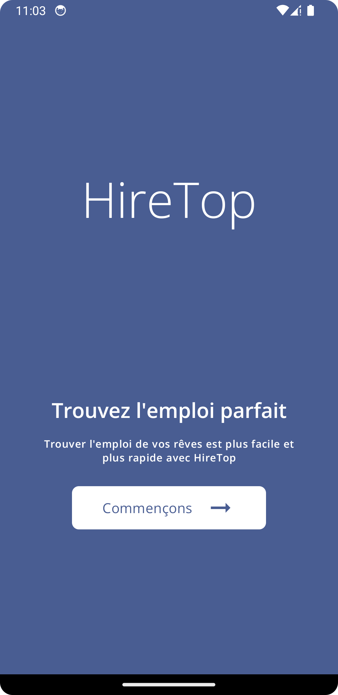
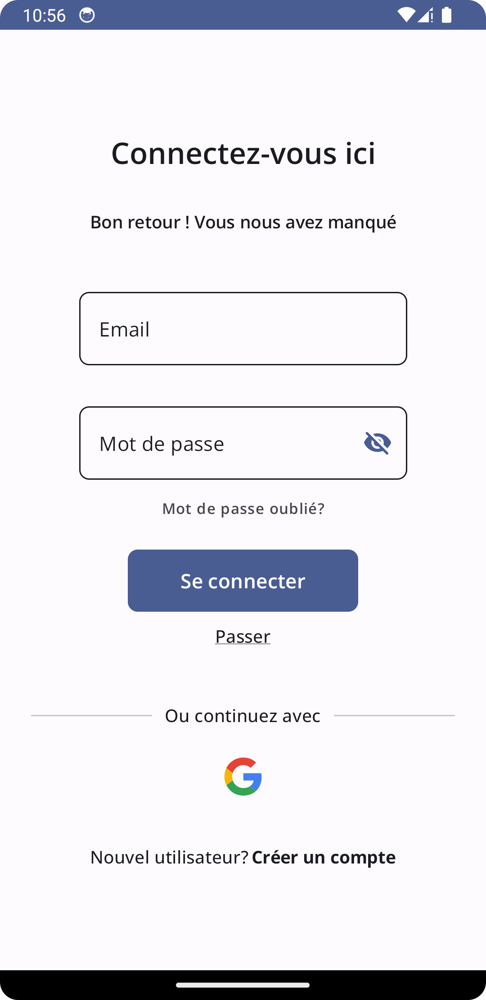
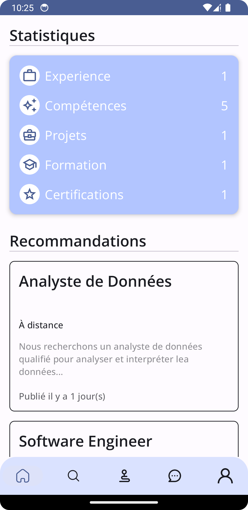
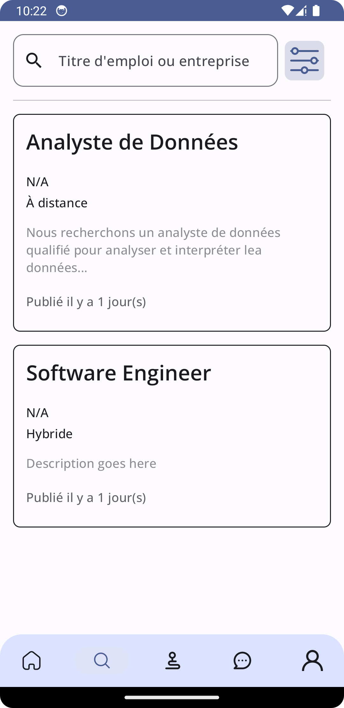
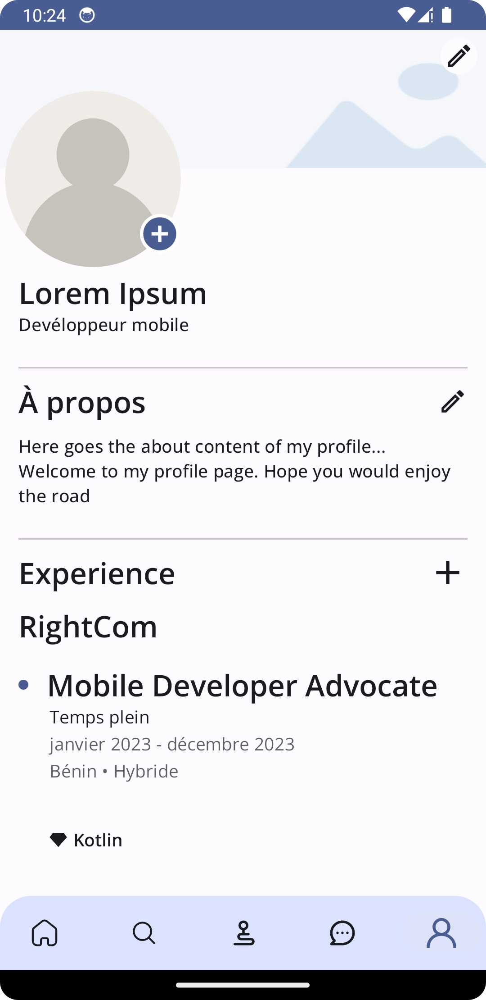
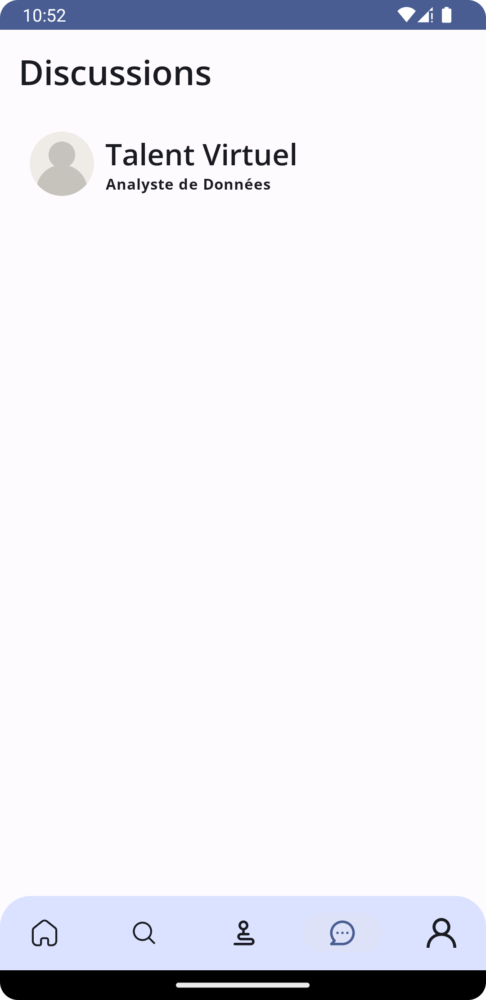
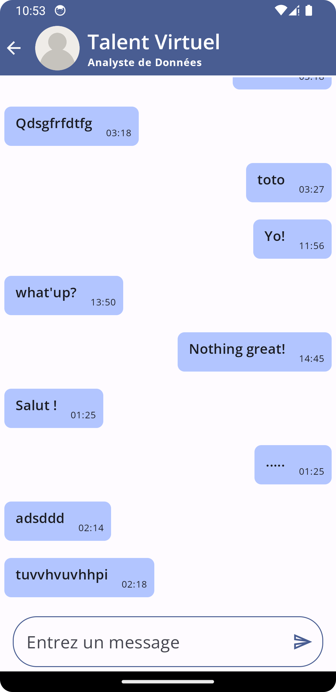
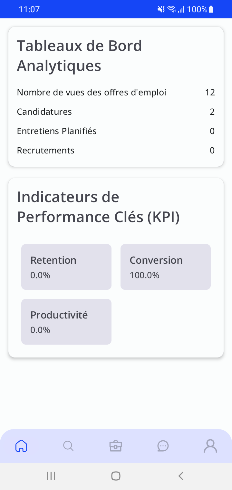
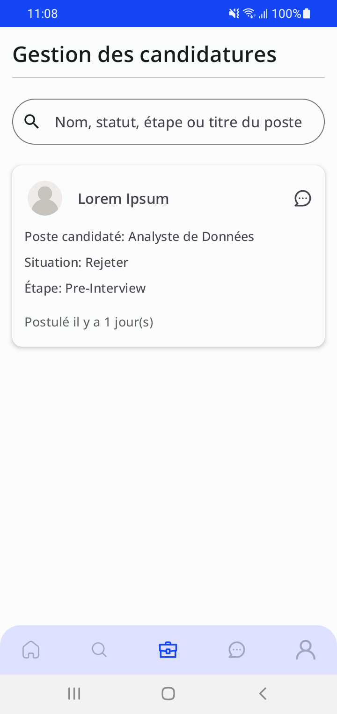

# HireTop

Ce projet est une application mobile développée pour la plateforme Hiretop, une plateforme de mise en relation entre étudiants, jeunes diplômés et entreprises à la recherche de talents. L'application vise à améliorer l'expérience utilisateur en fournissant des Dashboards personnalisés pour les utilisateurs (Talents) et les entreprises.

## Documentation

La documentation technique du projet est disponible dans le fichier [Documentation.txt](Documentation.txt) à la racine du projet. Cette documentation met en avant les choix technologiques effectués pour le développement de l'application et les raisons qui ont motivé ces choix.

## Fonctionnalités

### Dashboard Talents
- Profil Personnel : Permet aux utilisateurs de gérer leurs informations personnelles, compétences et expériences professionnelles.
- Exploration des Offres : Permet aux utilisateurs de rechercher et de postuler à des offres d'emploi pertinentes.
- Suivi des Candidatures : Permet aux utilisateurs de suivre l'état de leurs candidatures en temps réel.
- Statistiques et Recommandations : Fournit des insights sur les opportunités correspondant au profil du talent.

### Dashboard Entreprises
- Présentation de l'Entreprise : Permet aux entreprises de gérer leur présentation et leur marque employeur.
- Gestion des Offres d'Emploi : Permet aux entreprises de créer, éditer et promouvoir des offres d'emploi.
- Interaction avec les Talents : Permet aux entreprises d'interagir directement avec les talents et de planifier des entretiens.
- Statistiques de Marque Employeur : Fournit des indicateurs de performance pour mesurer l'impact des actions des entreprises sur la plateforme.

## Technologies Utilisées

- Kotlin
- JetPack Compose
- Android SDK

## Installation

Pour installer et exécuter l'application localement, suivez les étapes suivantes :

1. Cloner ce dépôt sur votre machine locale.
2. Assurez-vous d'avoir les outils de développement Android et Kotlin installés sur votre système.
3. Ouvrez le projet dans votre environnement de développement préféré (Android Studio, IntelliJ IDEA, etc.).
4. Compilez et exécutez l'application sur un émulateur Android ou un appareil Android connecté.

## Screenshots

    
    
    
    
    
    
    
    
    
    
    

## Licence

Ce projet est sous licence [MIT](LICENSE).
